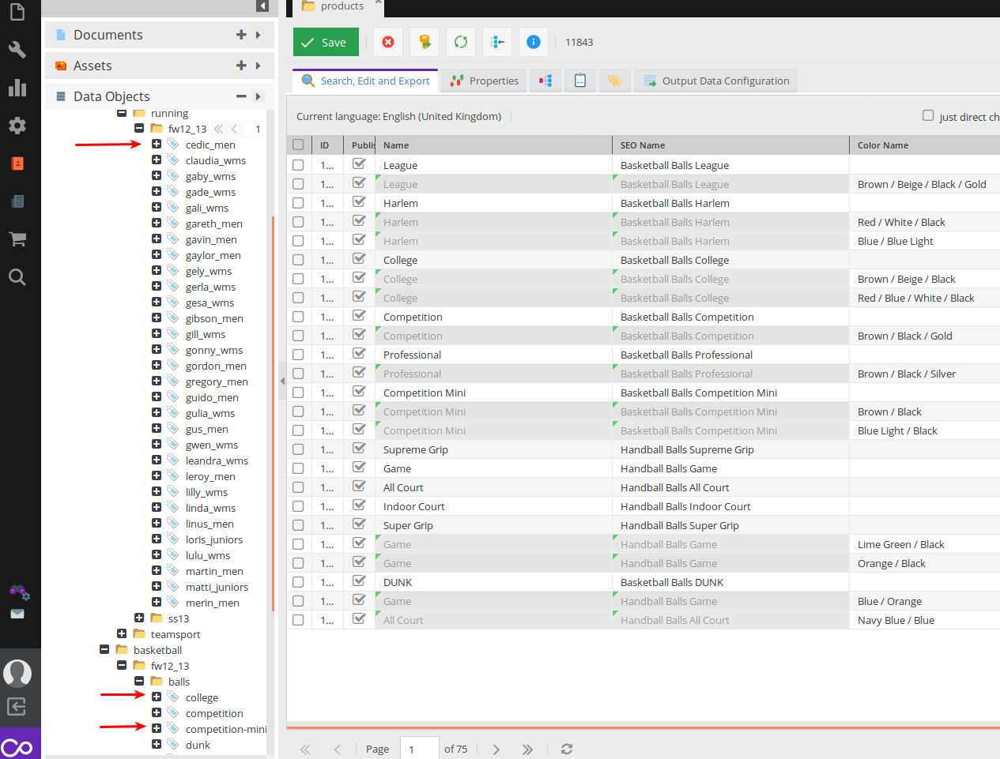
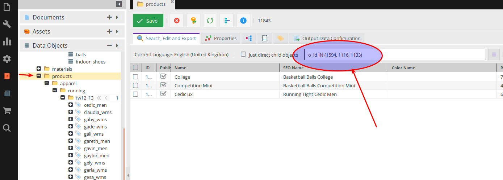
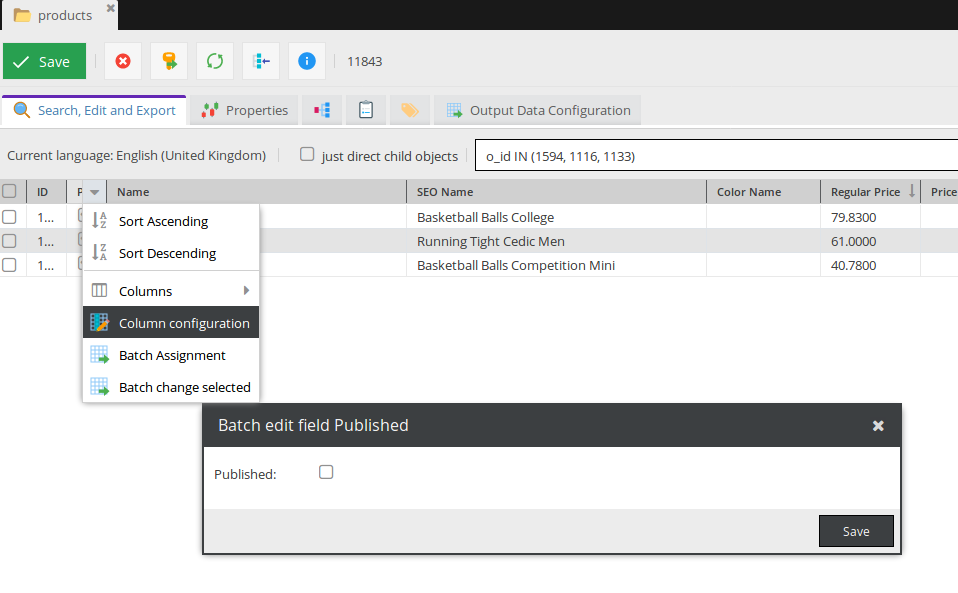

# Pimcore 5 Clipboard


[](LICENSE.md)
[](https://gitter.im/pimcore5-clipboard/Lobby?utm_source=badge&utm_medium=badge&utm_campaign=pr-badge&utm_content=badge)

## :warning: Pimcore 5 Clipboard bundle is for now in a in-progress phase - it can be incompleted for now and we cannot guaranty correct work. 

Pimcore 5 Clipboard Bundle gives you the possibility to **shelve your objects into a separated area** 
and perform chosen actions only on these separated objects - **without changing anything in your project structure!**

For example, you can easily add 3 of your products from different categories into the Clipboard and when times come publish them!

You can say that this kind of functionality is already in the native Pimcore and you'll be true. 
But please compare which is in your opinion more user-friendly:

* Pimcore Native 
    * first step - find your products

    * second step - remember their ids: `1594`, `1116`, `1133`
    * third step - filter them in their parent folder

    * fourth step - make some batch action

    * :-1:
        * who will remember these ids ...
        * it is not so easy to filter by ids (direct SQL query is needed)
        * if I don't want for now any action I need to remember these ids?
    
* Pimcore with Clipboard Bundle
    * first step - find your products
        * exactly the same as in Pimcore Native
    * second step - add them to the Clipboard
    * third step - go to Clipboard and make some actions
    * fourth step 
        * exactly the same as in Pimcore Native
    * :+1: 
        * no ids to remember
        * Clipboard has got just objects you added
        * everything is saved into the database so you don't need to remember anything

## So in other words:
> Sometimes the smallest things take up the most room in your heart

A.A. Milne (or Winnie-the-Pooh :smirk:)

## Compatibility
This module is compatible with Pimcore ^5.0.

## Requirements
This plugin requires php >= 7.0.

## Installing/Getting started
### First step - minimum stability
Because bundle is for now in the alpha phase you need to be sure that your composer.json minimum stability is alpha:
```
"minimum-stability": "alpha"
``` 
### Second step - fetch bundle
```
composer require divante-ltd/pimcore5-clipboard
```

### Third step - enable bundle
```
php bin/console pimcore:bundle:enable DivanteClipboardBundle
```

## Usage
* First step - add object(s) to the Clipboard
* Second step - navigate to the Clipboard
* Third step - batch edit objects

## Contributing
If you'd like to contribute, please fork the repository and use a feature branch. Pull requests are warmly welcome.

## Standards & Code Quality
This module respects our own PHPCS and PHPMD rulesets which are based on PSR-1 and PSR-2.

## About Authors
<a href="https://divante.co/"></a>

Founded in 2008 in Poland, Divante delivers high-quality e-business solutions. They support their clients in creating customized Omnichannel and eCommerce platforms, with expertise in CRM, ERP, PIM, custom web applications, and Big Data solutions. With 180 employees on board, Divante provides software expertise and user-experience design. Their team assists companies in their development and optimization of new sales channels by implementing eCommerce solutions, integrating systems, and designing and launching marketing campaigns.

Visit our website [Divante.co](https://divante.co/ "Divante.co") for more information.
